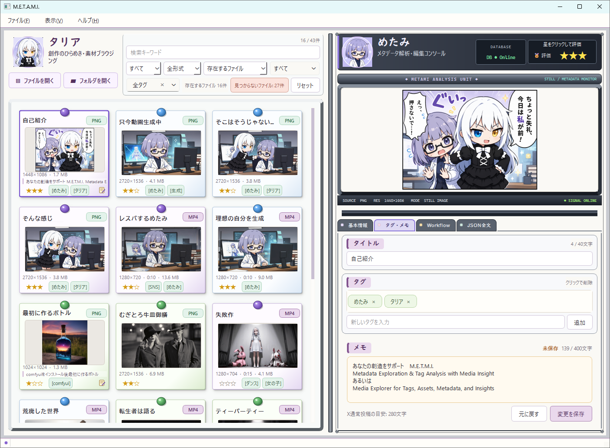
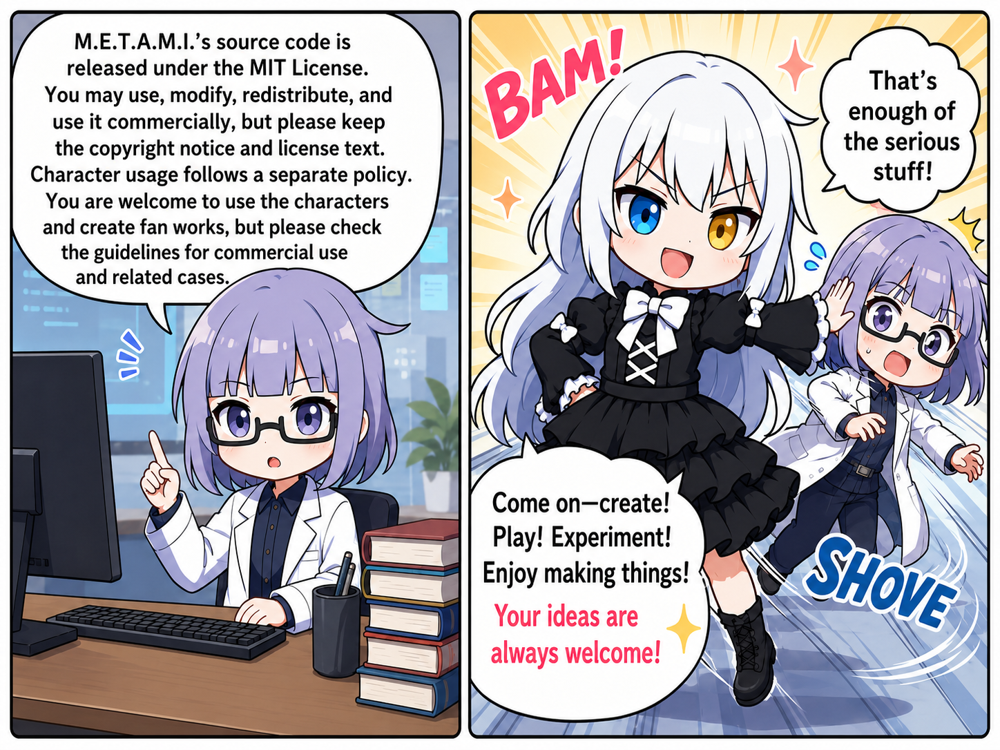

# M.E.T.A.M.I.

**読み方:** めたみ
**現在の状態:** Ver1.0.2

M.E.T.A.M.I.は、画像・動画の内容と埋め込みメタデータを確認し、
自分用の評価・タグ・メモを整理するWindows向けデスクトップアプリです。
原本ファイルへユーザー情報を書き込まず、M.E.T.A.M.I.専用のSQLite
データベースへ保存します。



## METAMIって何？

M.E.T.A.M.I.は「めたみ」と読みます。

英語でそれっぽく表すと、

- Metadata Exploration & Tag Analysis with Media Insight
- Media Explorer for Tags, Assets, Metadata, and Insights

あたりでしょうか。

厳密な正式名称というより、
「画像や動画のメタデータを見て、整理して、楽しむアプリ」
という雰囲気を名前に当てはめたものです。

## 主な機能

- PNG、WEBP、JPG/JPEG、MP4のファイル・フォルダ読込とドラッグ＆ドロップ
- サムネイル付きカード一覧
- 縦長・横長・1:1素材に応じたカード表示
- 画像プレビューとMP4再生
- ファイル名、解像度、サイズ、再生時間などの基本情報表示
- 対応メタデータからPrompt、Model、Seed等の生成情報を表示
- WorkflowとJSON全文の表示・コピー
- ファイル名、Prompt、Model、Seed、形式による検索・絞り込み
- 0～3の評価、複数タグ、400文字までのメモ、40文字までのユーザータイトル
- 評価・タグ・メモ・ユーザータイトルのSQLite保存と再起動後の復元
- 見つからないファイルの記録表示、再関連付け、DB記録削除

### ユーザータイトルについて

「タグ・メモ」タブで、メディアごとに40文字までの任意タイトルを
設定できます。設定時は実ファイル名よりユーザータイトルを優先して
カードへ表示し、未設定の場合だけ実ファイル名へ戻ります。長いタイトルは
一覧で省略し、全文はツールチップで確認できます。タイトルは原本ではなく
SQLiteへ保存され、検索対象にもなります。

## 対応形式

| 形式 | 一覧・プレビュー | 基本情報 | 埋め込みメタデータ |
|---|---:|---:|---:|
| PNG | 対応 | 対応 | `tEXt`、`zTXt`、`iTXt` |
| WEBP | 対応 | 対応 | EXIF、XMP、ICCプロファイル |
| JPG/JPEG | 対応 | 対応 | 詳細EXIF表示は対象外 |
| MP4 | 対応 | 対応 | MP4コンテナ内の文字列メタデータ |

JPG/JPEGはEXIF Orientationがある場合、Qtの自動変換機能で表示方向へ
反映します。EXIF情報そのものを編集・詳細表示する機能はありません。
ファイルやコーデックによっては、Windows側の再生対応状況によりMP4を
再生できないことがあります。

## 動作環境

- Windows 10／11（64bit）
- Python 3.12系
- PySide6 6.11.1

開発時の自動試験環境はPython 3.13.12／PySide6 6.11.1です。
別PCではIntel N100／メモリ16GB／Windows／Python 3.12のvenv環境で、
依存関係の導入、`python src\main.py`、`run_metami.bat`、対応形式の表示、
タイトル・タグ・メモおよび初期レイアウトを確認しています。

## セットアップと起動

ここでは、WindowsでM.E.T.A.M.I.を初めて使う方を対象に、
フォルダーを作るところから順番に説明します。

途中で黒い画面の「コマンドプロンプト」を使いますが、入力する内容は
すべて掲載しています。コマンドはまとめて入力せず、**上から1行ずつ**
入力してください。1つの処理が終わり、入力できる状態へ戻ってから
次の行へ進みます。

### 初めてインストールする場合

#### 手順1：GitとPythonをインストールする

最初に、次の2つをインストールします。

- [Git for Windows](https://git-scm.com/download/win)
- [Python 3.12](https://www.python.org/downloads/)

Gitは、GitHubからM.E.T.A.M.I.をダウンロードするために使います。
Pythonは、M.E.T.A.M.I.本体を動かすために使います。

Pythonのインストール画面では、`Add python.exe to PATH`へチェックを
入れてください。インストールが終わったら、一度開いている画面を閉じます。

#### 手順2：CドライブへMETAMIフォルダーを作る

M.E.T.A.M.I.を入れる場所は、次の場所を推奨します。

```text
C:\METAMI
```

次の順番で、普段どおりエクスプローラーを操作します。

1. キーボードの`Windows`キーと`E`キーを同時に押します。
2. エクスプローラーの左側にある「PC」または「このPC」をクリックします。
3. 「ローカル ディスク（C:）」をダブルクリックします。
4. Cドライブを開いて最初に表示された場所で、何もない部分を右クリックします。
5. 「新規作成」→「フォルダー」をクリックします。
6. フォルダー名を半角英字で`METAMI`にします。
7. 作成した`METAMI`フォルダーをダブルクリックして開きます。

フォルダー名には、日本語、空白、特殊な記号を使わないでください。
`METAMI`という名前をそのまま使用するのが確実です。

Cドライブへ作成できない場合は、「ドキュメント」など、自分が
ファイルを保存できる場所へ`METAMI`フォルダーを作っても構いません。

#### 手順3：METAMIフォルダーでコマンドプロンプトを開く

1. `METAMI`フォルダーを開いたまま、エクスプローラー上部の
   アドレスバーをクリックします。
2. 表示されている文字を消し、半角英字で`cmd`と入力します。
3. `Enter`キーを押します。

黒いコマンドプロンプト画面が開きます。画面の最後が
`METAMI>`のようになっていれば、正しいフォルダーを開けています。

#### 手順4：M.E.T.A.M.I.をダウンロードする

黒いコマンドプロンプト画面へ次の1行を入力し、`Enter`キーを押します。

```cmd
git clone https://github.com/meTalia-jp/METAMI.git .
```

最後の`.`も必要です。これは、現在開いている`METAMI`フォルダーの中へ
ファイルを入れる、という意味です。

文字が何行か表示され、再び入力できる状態になったらダウンロード完了です。

#### 手順5：M.E.T.A.M.I.専用のPython環境を作る

次の1行を入力し、`Enter`キーを押します。処理が終わるまで待ちます。

```cmd
py -3.12 -m venv .venv
```

この操作で作るvenv（仮想環境）は、M.E.T.A.M.I.に必要なものを
ほかのPythonアプリと分けて保管するための専用環境です。

処理が終わったら、次の1行を入力します。

```cmd
.venv\Scripts\activate.bat
```

成功すると、入力する行の先頭に`(.venv)`と表示されます。

```text
(.venv) METAMI>
```

#### 手順6：必要なパッケージをインストールする

行頭に`(.venv)`と表示されていることを確認し、次の2行を
上から1行ずつ実行します。

```cmd
python -m pip install --upgrade pip
python -m pip install -r requirements.txt
```

`pip`は、Pythonへ追加パッケージをインストールする仕組みです。
M.E.T.A.M.I.では、画面表示に必要なPySide6をインストールします。
SQLiteはPythonに含まれているため、別途インストールする必要はありません。

#### 手順7：初めて起動する

行頭に`(.venv)`と表示されている状態で、次の1行を実行します。

```cmd
python src/main.py
```

M.E.T.A.M.I.の画面が表示されれば、インストールは完了です。
アプリを閉じると、黒いコマンドプロンプト画面へ戻ります。

### 2回目以降に起動する場合

初回インストールが終わった後は、コマンドを入力する必要はありません。

1. エクスプローラーで`METAMI`フォルダーを開きます。
2. `run_metami.bat`をダブルクリックします。

これだけでM.E.T.A.M.I.が起動します。

`run_metami.bat`が見つからない場合は、別の`METAMI`フォルダーを
開いていないか確認してください。

### うまく進まない場合

- 「`git`は認識されていません」と表示された場合：
  Git for Windowsをインストールした後、コマンドプロンプトを開き直します。
- 「`py`は認識されていません」と表示された場合：
  Python 3.12を再インストールし、`Add python.exe to PATH`へチェックを入れます。
- `(.venv)`が表示されない場合：
  `.venv\Scripts\activate.bat`をもう一度実行します。
- `run_metami.bat`で起動できない場合：
  初回インストールの手順5と手順6が完了しているか確認します。

## 基本操作

1. 「ファイルを開く」または「フォルダを開く」で素材を追加します。
2. 左側のカードを選択すると、右側へプレビューと情報が表示されます。
3. 検索欄と各フィルターで一覧を絞り込みます。
4. 右上の星で0～3の評価を設定します。
5. 「タグ・メモ」タブでタイトル、タグ、メモを保存します。
6. 「Workflow」「JSON全文」タブで埋め込み情報を確認します。

## データベースと原本保護

実行時データベースは次の場所へ自動作成されます。

```text
data/metami.db
```

- 評価、タグ、メモ、ユーザータイトル、ファイル状態、確認済みパスを保存します。
- 原本画像・動画へ評価、タグ、メモ、ユーザータイトルを書き込みません。
- 原本のファイル名変更、移動、削除、メタデータ書換えを行いません。
- バックアップする場合は、アプリを終了してから`data/metami.db`を
  安全な場所へコピーしてください。
- `data/metami.db`はGit管理対象外です。

### missing管理

登録済みパスに原本が存在しない場合、記録を`missing`として保持します。
通常一覧からは除外されますが、ファイル状態フィルターで確認できます。

- 「ファイルを探す」: ユーザー確認後、新しいパスへDB記録を関連付けます。
- 「METAMIの記録を削除」: 評価・タグ関連・メモ・パス履歴をDBから
  削除します。原本ファイルは削除しません。

## プライバシー

次の内容はGitHubへ追加しないでください。

- `data/metami.db`およびSQLiteの補助ファイル
- `sample/`内の私物画像・動画
- メモ、個人情報、ローカルパスを含むログ
- APIキー、トークン、`.env`等の秘密情報
- バックアップ、出力物、キャッシュ

本リポジトリはサンプルDBを配布せず、初回起動時に空DBを生成します。

## テスト

venvを有効化した状態で実行します。

```cmd
python -m unittest discover -s tests -v
```

公開前には[GitHub公開前チェックリスト](docs/GITHUB公開前チェックリスト.md)
も確認してください。

## 別PCでの確認と不具合報告

別PCでは、このREADMEの「セットアップ」から順に実施してください。
初回起動後に`data/metami.db`が生成されることを確認し、本人が権利を持つ
PNG、WEBP、JPG/JPEG、MP4を1件ずつ読み込んでください。

不具合報告には次の情報を含めてください。

- M.E.T.A.M.I.のバージョン
- Windowsのバージョンと表示倍率
- `python --version`
- `python -c "import PySide6; print(PySide6.__version__)"`
- 再現手順と表示されたエラーメッセージ
- ファイル形式と縦横サイズ

個人ファイル、DB、メモ、フルパス、生成Promptをそのまま添付しないで
ください。公開後はGitHub Issuesの案内に従ってください。

## スクリーンショット

上部のメイン画面は、ユーザータイトルを優先表示し、基本情報タブを
開かないことで実ファイル名・実フォルダー名・フルパスを表示しない
公開用構成です。

## プロジェクトメッセージ

### 日本語


### English



## ライセンスと素材

M.E.T.A.M.I.のソースコードは[MIT License](LICENSE)で公開します。

```text
Copyright (c) 2026 meTalia-jp
```

MIT Licenseはソースコードに適用されます。タリア、めたみ、ロゴ、
キャラクター画像、関連イラスト、高解像度原画および制作データは
MIT License対象外です。

PySide6／Qt for Pythonは本リポジトリへ同梱せず、利用者がpipで導入します。
Qt for PythonはLGPLv3／GPLv3または商用ライセンスで提供されています。
本リポジトリではPythonソースだけを公開し、PySide6、Shiboken6、Qt本体を
同梱・改変せず、GPL専用のQtモジュールも使用しません。ライセンス条件は
[Qt for Python公式ドキュメント](https://doc.qt.io/qtforpython-6/)
および配布パッケージの表示を確認してください。

将来、実行ファイル化してQtライブラリを同梱・再配布する場合は今回の判断
対象外とし、LGPLv3を含む適用条件を改めて確認します。

キャラクター、ロゴ、画像素材はソースコードと別の権利物として扱います。
詳細は[素材の権利表記](src/assets/README.md)と
[NOTICE](NOTICE.md)を参照してください。
開発用GUIモックアップ4画像はGitHub公開対象に含めません。

### キャラクター利用方針

- 非商用のファンアート・二次創作を歓迎します。
- キャラクターの改変や別解釈を許可します。
- SNSや個人サイトへの非商用投稿を許可します。
- 商用利用は事前相談とします。
- 公式と誤認させる利用は禁止します。
- 違法、差別、嫌がらせ目的の利用は禁止します。
- キャラクター素材そのものの無断販売は禁止します。
- 高解像度原画や制作データは公開対象外です。

## 開発言語とコントリビューション

本プロジェクトは日本語中心で開発・保守します。Issueや説明は日本語を
基本としますが、英語ドキュメント、英語UI、翻訳改善のPull Requestを
歓迎します。

## 既知の制約

- MP4再生可否はWindowsとQtが利用できるコーデックに依存します。
- JPEGの詳細EXIF表示・編集には対応していません。
- Xの280文字表示は目安で、X固有の重み付き文字数計算ではありません。
- ファイル移動・改名の完全ハッシュによる自動追跡は行いません。
- UIと文書は日本語中心で、英語UIはまだありません。

## 開発状況と今後

- 現在: Ver1.0.2
- 公開後: 不具合修正を優先し、新機能は別バージョンで検討

タリアポイント、METAMIカード、AI画像解析等は将来構想であり、
Ver1.0.0には含まれません。
